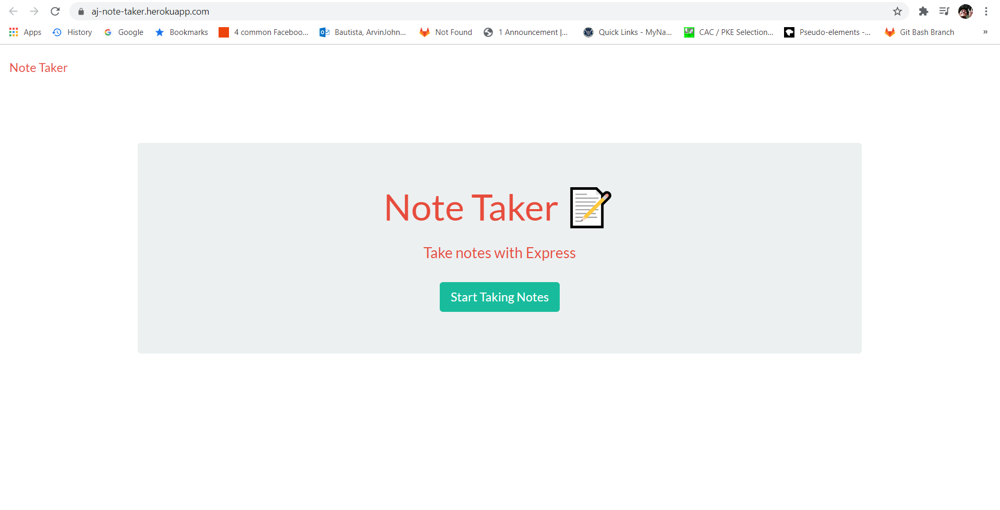

# 11 Express.js: Note Taker

## Description
A web-based application that can be used to write and save notes to keep track of tasks that the user needs to complete.    
This application will be using an Express.js as a back end and will save/retrieve notes data from a JSON file.  
The entire application is currently deployed to heroku.com

## Deployed URL

https://aj-note-taker.herokuapp.com/

## Screenshots

- Homepage screenshot.  

- The sample notes-taking functional page.  

## Acknowledgements
- Mr. John
- Mr. Luis
- Would like to commend the following persons for helping directly(guiding me what to do next)/indirectly(asking questions that I'm not aware of):
  - Oliver Shi
  - Brian Hernandez
  - Javier Perez